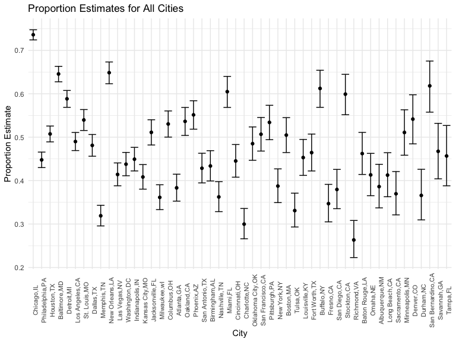
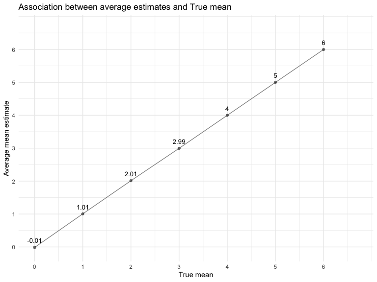
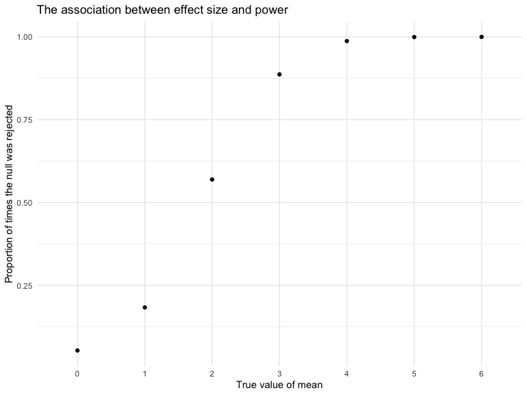
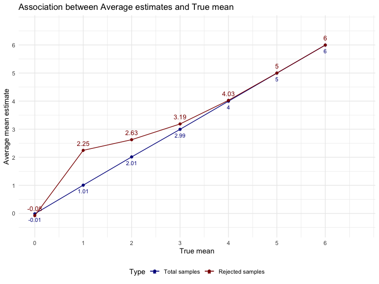

p8105_nr2774
================

### Problem 1

### Problem 2

``` r
df = read_csv(file = "data_hw5/homicide-data.csv") |> 
    janitor::clean_names() |> 
    mutate(city_state = str_c(city, ",", state )) |>
    as.tibble()
```

``` r
# reported date range 
pull(df,reported_date) |> 
  as.character() %>% 
  range()
```

    ## [1] "20070101" "20171231"

``` r
#victim's age range
pull(df,victim_age) |> 
    as.character() |> 
    as.integer() |>  
    range(na.rm =TRUE)
```

    ## [1]   0 102

#### Describe the raw data:

This data set contains 52179 homicides records. Reported date range is
from 20070101 to 20171231 and victim age range is from 0 to 102 years
old. Other information such as victim\`s name,race,sex and the location
details and disposition state of these homicides were included in this
data set.

In order to check if the number of city_state matches with city.i run
the folowoing code.

``` r
#the number of city_state 
nrow(distinct(df,city_state))
```

    ## [1] 51

``` r
# the number of cities
nrow(distinct(df,city))
```

    ## [1] 50

``` r
#check the dataset and find the city "Tulsa" shows up in two states:
 filter(df,city == "Tulsa") |> 
     distinct(state)
```

    ## # A tibble: 2 × 1
    ##   state
    ##   <chr>
    ## 1 OK   
    ## 2 AL

Number of city_state were 51 whereas number of state was 50. It means
there was an overlap with city names. After filtering, city “Tulsa” was
recorded both in Oklahoma and Al. Therefore, Tulsa recorded under Al
will be excluded from further data set.  
\* Homocide

``` r
# Why there is still 51 variables ??
homicide_sum = df |>  
    group_by(city_state) |> 
    summarise(total_homicides = n()) |> 
    filter(city_state != "Tulsa,AL")
```

-   Creating homocide summary table

``` r
# Summarize within cities to obtain the total number of homicides and the number of unsolved homicides

homicide_sum = df %>% 
  #exclude "Tulsa, AL"
  group_by(city_state) %>% 
  mutate(
    unsolved = ifelse(disposition == "Closed by arrest",0,1)
      ) %>% 
  summarise(
    total_homicides = n(),
    unsolved_homicides = sum(unsolved)
  ) %>% 
  arrange(desc(total_homicides)) |> 
    subset(city_state != "Tulsa,AL")
homicide_sum %>% 
  knitr::kable() 
```

| city_state        | total_homicides | unsolved_homicides |
|:------------------|----------------:|-------------------:|
| Chicago,IL        |            5535 |               4073 |
| Philadelphia,PA   |            3037 |               1360 |
| Houston,TX        |            2942 |               1493 |
| Baltimore,MD      |            2827 |               1825 |
| Detroit,MI        |            2519 |               1482 |
| Los Angeles,CA    |            2257 |               1106 |
| St. Louis,MO      |            1677 |                905 |
| Dallas,TX         |            1567 |                754 |
| Memphis,TN        |            1514 |                483 |
| New Orleans,LA    |            1434 |                930 |
| Las Vegas,NV      |            1381 |                572 |
| Washington,DC     |            1345 |                589 |
| Indianapolis,IN   |            1322 |                594 |
| Kansas City,MO    |            1190 |                486 |
| Jacksonville,FL   |            1168 |                597 |
| Milwaukee,wI      |            1115 |                403 |
| Columbus,OH       |            1084 |                575 |
| Atlanta,GA        |             973 |                373 |
| Oakland,CA        |             947 |                508 |
| Phoenix,AZ        |             914 |                504 |
| San Antonio,TX    |             833 |                357 |
| Birmingham,AL     |             800 |                347 |
| Nashville,TN      |             767 |                278 |
| Miami,FL          |             744 |                450 |
| Cincinnati,OH     |             694 |                309 |
| Charlotte,NC      |             687 |                206 |
| Oklahoma City,OK  |             672 |                326 |
| San Francisco,CA  |             663 |                336 |
| Pittsburgh,PA     |             631 |                337 |
| New York,NY       |             627 |                243 |
| Boston,MA         |             614 |                310 |
| Tulsa,OK          |             583 |                193 |
| Louisville,KY     |             576 |                261 |
| Fort Worth,TX     |             549 |                255 |
| Buffalo,NY        |             521 |                319 |
| Fresno,CA         |             487 |                169 |
| San Diego,CA      |             461 |                175 |
| Stockton,CA       |             444 |                266 |
| Richmond,VA       |             429 |                113 |
| Baton Rouge,LA    |             424 |                196 |
| Omaha,NE          |             409 |                169 |
| Albuquerque,NM    |             378 |                146 |
| Long Beach,CA     |             378 |                156 |
| Sacramento,CA     |             376 |                139 |
| Minneapolis,MN    |             366 |                187 |
| Denver,CO         |             312 |                169 |
| Durham,NC         |             276 |                101 |
| San Bernardino,CA |             275 |                170 |
| Savannah,GA       |             246 |                115 |
| Tampa,FL          |             208 |                 95 |

-   Baltimore analysis

``` r
# Estimating the proportion of unsolved homicides in Baltimore, MD

baltimore_prop = 
  homicide_sum %>%
  filter(city_state == "Baltimore,MD")
 test_prop = prop.test(baltimore_prop$unsolved_homicides, baltimore_prop$total_homicides)
 
 test_prop %>% 
  broom::tidy() %>% 
  select(estimate, conf.low, conf.high)
```

    ## # A tibble: 1 × 3
    ##   estimate conf.low conf.high
    ##      <dbl>    <dbl>     <dbl>
    ## 1    0.646    0.628     0.663

-   Iteration for all cities (proportion of unsolved homicides)

``` r
# Estimating the proportion of unsolved homicides in all cities by applying iteration 
all_cities_proportion = 
  homicide_sum |> 
  mutate(
    tests_prop = purrr::map2(.x = unsolved_homicides, .y = total_homicides, ~prop.test(x = .x, n = .y)),
    tests_tidy = purrr::map(.x = tests_prop, ~broom::tidy(.x))
  ) |>  
  select(-tests_prop) |>  
  unnest(tests_tidy) |>  
  select(city_state, estimate, starts_with("conf"))
```

``` r
all_cities_proportion |>  
  mutate(city_state = fct_inorder(city_state)) |>  
  ggplot(aes(x = city_state, y = estimate, fill = city_state)) + 
    geom_point() + geom_errorbar(aes(ymin = conf.low, ymax = conf.high)) +
    theme(axis.text.x = element_text(angle = 90,size = 8)) +
  theme(legend.position = "none") +
  labs(x = "City",y = "Proportion Estimate",title = "Proportion Estimates for All Cities")
```



### Problem 3

-   Conducting a simulation to explore power in a one-sample t-test.

``` r
# Construct function for one-sample t-test

sim_mean_ttest = function(true_mean) {
    simulation_data = tibble(x = rnorm(n =30, mean = true_mean, sd = 5)
                             )
test_data = t.test(simulation_data, mu = 0, conf.level = 0.95 ) 
    
  simulation_data %>% 
    summarize(
      estimate = pull(broom::tidy(test_data), estimate),
      p_value = pull(broom::tidy(test_data), p.value)
    )
}

sim_results_df = 
  expand_grid(
    true_mean = c(0:6), 
    iteration = 1:5000
  ) %>%
  mutate(
    estimate_df = map(true_mean, sim_mean_ttest)
  ) %>% 
  unnest(estimate_df)
```

``` r
# A plot showing the proportion of times the null was rejected

sim_results_df |>
    filter(p_value < 0.05) |> 
    group_by(true_mean) |> 
    summarise(rejected_num = n(), rejected_prop = rejected_num/5000) |> 
    ggplot(aes(x = as.factor(true_mean), y = rejected_prop)) + 
    geom_point() +
    labs(
        title = "The association between effect size and power",
        x = "True value of mean", 
        y = "Proportion of times the null was rejected") 
```


#### Describe the association between effect size and power

As the true mean get further away from 0, its gets easier to reject the
null value, another words the power increases. The chance that the Null
hypothesis will be rejected in increases. Bigger the difference between
true mean and the null is, it will get closer to 1, meaning that when
effect size increases, the power gets bigger. Therefore, there is a
positive correlation between the power of the test and the effect size.

``` r
# Average estimate plot 
sim_results_df |>  
  group_by(true_mean) %>% 
  summarise(avg_estimate = mean(estimate)) %>% 
  ggplot(aes(x = true_mean, y = avg_estimate)) +
  geom_point(alpha = 0.5) +
  geom_line(alpha = 0.5) +
  geom_text(aes(label = round(avg_estimate,2)), vjust = -1, size = 3.5) + 
  scale_x_continuous(limits = c(0,6.7), breaks = seq(0,6,1)) +
  scale_y_continuous(limits = c(-0.1,6.7), breaks = seq(0,6,1)) +
  labs(
    title = "Association between average estimates and True mean",
    x = "True mean",
    y = "Average mean estimate"
  ) 
```



``` r
sim_results_df |> 
    filter(p_value < 0.05) |> 
    group_by(true_mean) |> 
    summarise(rejected_num = n(), rejected_prop = rejected_num/5000) |> 
    ggplot(aes(x = as.factor(true_mean), y = rejected_prop)) + 
    geom_point() +
    labs(
        title = "The association between effect size and power",
        x = "True value of mean", 
        y = "Proportion of times the null was rejected") 
```



``` r
# The second plot (or overlay on the first) the average estimate of mu only in samples for which the null was rejected on the y axis and the true value of mu on the x axis.

sim_rejected = sim_results_df %>% 
  filter(p_value < 0.05) %>% 
  group_by(true_mean) %>% 
  summarise(avg_estimate = mean(estimate)) 

sim_results_df %>% 
  group_by(true_mean) %>% 
  summarise(avg_estimate = mean(estimate)) %>% 
  ggplot(aes(x = true_mean, y = avg_estimate, color = "Total samples")) +
  geom_point() +
  geom_line() + 
  geom_text(aes(label = round(avg_estimate,2)), vjust = 2, size = 3) +     geom_point(data = sim_rejected, aes(color = "Rejected samples")) +
  geom_line(data = sim_rejected, aes(x = true_mean, y = avg_estimate, color = "Rejected samples")) + 
  geom_text(data = sim_rejected, aes(label = round(avg_estimate,2), color = "Rejected samples"), vjust = -1, size = 3.5) + 
  scale_x_continuous(limits = c(0,6.7), breaks = seq(0,6,1)) +
  scale_y_continuous(limits = c(-0.5,6.7), breaks = seq(0,6,1)) +
  labs(x = "True mean",
       y = "Average mean estimate",
       title = "Association between Average estimates and True mean",
       color = "Type") + scale_color_manual(values = c("Total samples" = 'darkblue', "Rejected samples" = "darkred"))
```



#### Is the sample average of μ̂ across tests for which the null is rejected approximately equal to the true value of μ? Why or why not?

-   In terms of total samples, the average estimate means are rougly
    equal to the true means. On the other hand, this trend was different
    for the rejected samples. When the true mean was smaller at 0,1,2,3
    , the sample average where Null was rejected was different from true
    mean value. When true mean was is at 4,5,6 average estimate for
    rejected were roughly the same. In other words, as effect size
    increases the the probability of rejecting null hyphothesis
    increases. The larger true mean ( larger/ total sample = close to 1
    value) close to value 1 allows us to reject the null hypothesis with
    less error with more power.
